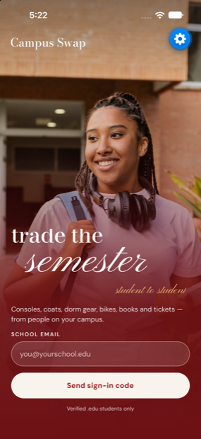
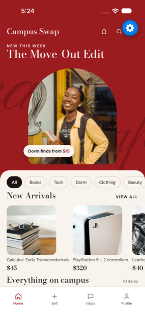
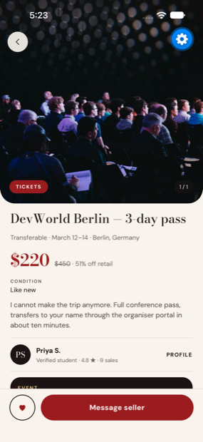
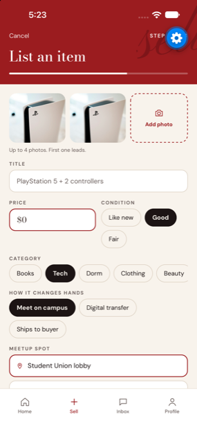
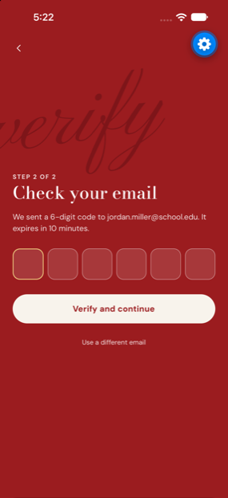
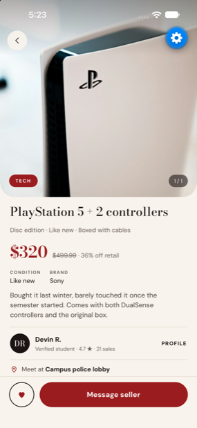
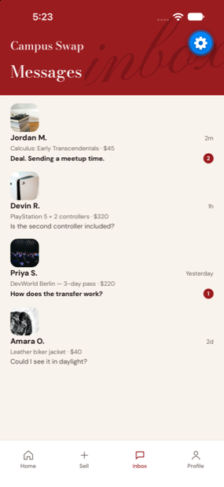
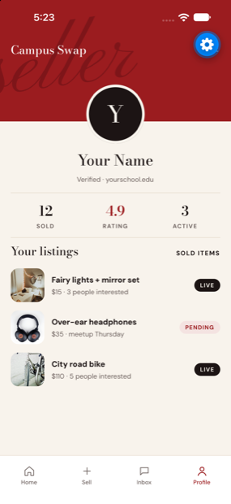

<div align="center">

# Campus Swap

**A student-only marketplace for iOS — verified `.edu` sign-in, campus meetups, and tickets from the student section to conferences abroad.**

[](https://expo.dev)
[](https://reactnative.dev)
[](https://www.typescriptlang.org)
[](https://nestjs.com)
[](https://www.prisma.io)

</div>

---

<div align="center">











<sub>Running on an iPhone 16 Pro Max simulator</sub>

</div>

---

## The problem

Students sell to each other constantly — a console at the end of term, a jacket,
a conference pass they can no longer use — and the options are all bad. Facebook
Marketplace means meeting strangers off campus. Class group chats bury listings
in minutes. Craigslist is Craigslist.

Campus Swap makes the campus itself the trust boundary. You can only join with a
verified `.edu` address, every seller shows a rating and sale count, and handoffs
default to named public spots like the student union lobby.

## What it does

Sign in with a school email and a six-digit code — no passwords to leak or
reset. Browse anything students actually trade across ten categories, from
textbooks and consoles to clothing, bikes and beauty. List an item in a single
screen that adapts to what you're selling: clothing asks for size and fit,
tickets ask for the event, venue and transfer method. Message a seller and agree
on a meetup spot.

Tickets get first-class treatment because they don't behave like physical goods.
A dorm lamp is a campus handoff; a three-day conference pass in Berlin is a
digital transfer to someone who will never meet you. Both are listings, and the
model handles the difference rather than pretending it doesn't exist.

## Engineering worth looking at

**Authentication is the part I'd most want to be asked about.** Sign-in codes are
only about twenty bits of entropy, so the system is built assuming the database
will leak. Codes are never stored in the clear — they're HMAC-SHA256 hashed with
a pepper held in the environment, so a stolen dump alone can't be brute-forced
offline. Comparison uses `timingSafeEqual`. Each code allows five attempts before
it dies, with separate hourly rate limits per email address and per IP so one
address can't be farmed and one host can't spray many addresses.

Refresh tokens rotate on every use and are grouped into a family per device.
Presenting a token that was already rotated is a strong signal that someone is
replaying a stolen credential, so the entire family is revoked — logging out both
the attacker and the real user rather than silently letting the theft continue.
Requesting a code returns an identical response whether or not the account
exists, so the endpoint can't be used to enumerate which students have signed up.

**One schema, two consumers.** Validation rules live in a shared package of Zod
schemas that both the app and the API import. A rule like "a meetup listing must
name a meetup spot" or "a ticket listing must carry an event" is written once and
enforced on both sides, so the client can't drift from the server.

**Modelling decisions that buy future flexibility.** Money is stored as integer
cents everywhere, because floats and prices don't mix. A `deliveryMethod` field
separates how an item changes hands from what it is, which is what lets a campus
meetup and an international ticket transfer share one model. Category-specific
attributes live in a JSONB `details` column, so adding a new category is a
product decision rather than a database migration.

**Type safety taken seriously.** The whole monorepo runs TypeScript 6 in strict
mode with `noUncheckedIndexedAccess`, and ESLint bans `any` outright. One
deliberate exception: `consistent-type-imports` is disabled for the API, because
"fixing" those imports would erase the decorator metadata NestJS relies on and
silently break dependency injection at runtime.

## Built with

| Layer | Choices |
| --- | --- |
| iOS app | Expo SDK 57, React Native 0.86, Expo Router, Reanimated, TanStack Query, Zustand |
| API | NestJS 11, Prisma, PostgreSQL, JWT access + refresh rotation, Zod validation |
| Shared | TypeScript 6 strict, Zod schemas consumed by both sides |
| Tooling | npm workspaces, ESLint 9 flat config, Prettier, Jest, GitHub Actions |

Continuous integration runs linting, type-checking and the test suite, then
separately spins up Postgres to apply migrations and fail the build if
`schema.prisma` has drifted from the migration history.

## Running it

```bash
cd campus-swap
npm install
npm run dev:mobile      # Metro; press i for the iOS Simulator
```

The API additionally needs Postgres:

```bash
cp apps/api/.env.example apps/api/.env   # fill in the three secrets
npm run db:up                            # Postgres + Redis via Docker
npm run prisma:migrate --workspace @campus-swap/api
npm run dev:api
```

Verify everything with `npm run lint`, `npm run typecheck` and `npm test`.

## Project status

This is an in-progress portfolio project, and it's worth being precise about
where the line currently sits.

The iOS app is built and running: sign-in, code verification, feed, listing
detail, the create-listing flow, inbox, chat and profile. It currently renders
from a demo dataset, so the screenshots above are the real app rather than
mockups, but the listing screens are not yet reading from the API.

On the backend, authentication is implemented and unit tested — 26 tests cover
code hashing, attempt limits, rate limiting and refresh-token reuse detection.
The Prisma schema models the full domain across twelve tables, including
listings, photos, saved items, conversations, messages, reviews, reports and
blocks.

Next up is wiring the app to the live API, then the listing and messaging
endpoints. Deployment configuration for Vercel and Render is already in the repo.
