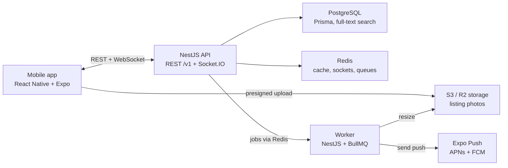

# Campus Swap — Build Plan

Sep 29, 2026 · Kelvin

## Goal

Ship Campus Swap, a student-only marketplace for anything students buy and sell, to the App Store and Play Store in 10 weeks, with 100+ real users at your school by the end of the semester.

"Anything" is literal. A PlayStation, a winter coat, a mini fridge, a guitar, a bike, skincare, a calculus textbook, a ticket to Thursday's game, a pass to a conference in Berlin. Ten categories cover it: Books & Study, Tech & Gaming, Dorm & Furniture, Clothing & Shoes, Beauty & Care, Tickets & Events, Sports & Outdoors, Music & Instruments, Bikes & Scooters, Everything Else. Clothing, beauty and sports listings carry an optional men's / women's / unisex tag and a free-text size, so the feed can be filtered without splitting the app in two.

Recruiters should see three things within 30 seconds of opening the repo:

- **It's live**: store links and a demo video at the top of the README.
- **Real people use it**: user count, listings posted, messages sent.
- **Real engineering**: real-time chat, image pipeline, push notifications, verified auth, moderation, tests and CI/CD.

## MVP scope

The MVP covers the six screens in `design/screens/`: sign in, feed, listing, sell, chat, profile. Everything else waits until real users ask for it.

| In the MVP | After launch |
| --- | --- |
| .edu email sign-in with one-time code | Google/Apple sign-in |
| Create listing with up to 4 photos | Video listings |
| Ten categories, any item a student owns | Category-specific sell flows |
| Men's / women's / unisex and size tags on clothing | Full size charts and brand pages |
| Feed with category filters and search | Saved searches with alerts |
| Real-time 1:1 chat with read receipts | Group chats |
| Campus, city and worldwide event tickets | Ticketmaster / Eventbrite transfer integration |
| Meetup proposal card (place + time) | Map view of meetup spots |
| Push notifications for new messages | Email digests |
| Report listing or user, admin review queue | Automated image moderation |
| Seller ratings after a completed meetup | In-app payments |

No in-app payments in v1. Cash or Venmo at the meetup keeps you out of payment compliance and fraud disputes.

**Tickets that aren't local.** A campus game ticket changes hands at a meetup like anything else. A conference pass in another country cannot, so every listing carries a `deliveryMethod` of `meetup`, `digital` or `shipping`. Only `meetup` requires a meetup spot; digital and shipped listings skip the meetup card and show a transfer note instead. Ticket listings also carry an event block (name, start time, venue, city, country, virtual flag, quantity, transfer method) and an `eventScope` of campus, city or global, which is what keeps a dorm show and a Berlin conference in the same feed without confusing either.

## Tech stack

TypeScript end to end, so one language covers the app, the API and the shared types.

| Layer | Choice | Why |
| --- | --- | --- |
| Mobile app | React Native + Expo (Expo Router) | One codebase for iOS and Android; EAS builds and store submission |
| App state | TanStack Query + Zustand | Server cache and optimistic updates; small local state |
| API | Node.js + NestJS | Structured modules, guards and DTO validation that read like production code |
| Real-time | Socket.IO (with Redis adapter) | Chat, typing indicators, read receipts; scales past one server |
| Database | PostgreSQL + Prisma | Relational data, migrations, full-text search with `tsvector` |
| Cache and queues | Redis + BullMQ | Socket fan-out, rate limits, background jobs (image resize, notifications) |
| Images | S3 or Cloudflare R2, presigned uploads | Phone uploads straight to storage; the API never touches the bytes |
| Auth | Email one-time code (Resend) + JWT access/refresh tokens | Proves a real .edu address without passwords |
| Push | Expo Notifications | One API for APNs and FCM |
| Hosting | Railway or Render (API, Postgres, Redis) | Cheap, fast deploys, preview environments |
| Quality | Jest, Supertest, Maestro (mobile E2E), GitHub Actions, Sentry | Tests, CI/CD and crash reporting |

## Architecture

One NestJS service handles REST and sockets. A separate worker process pulls jobs from Redis to resize photos and send push notifications, so slow work never blocks a request.

## Data model

Eight Postgres tables cover the MVP. Every row carries `schoolId`, so one deployment can serve a second campus later without a rewrite.

| Table | Key columns | Notes |
| --- | --- | --- |
| schools | id, name, emailDomain | Seeded; `emailDomain` gates sign-up |
| users | id, schoolId, email, displayName, avatarUrl, ratingAvg, ratingCount, pushToken, status | `status`: active, suspended |
| listings | id, sellerId, schoolId, title, description, priceCents, compareAtPriceCents, category, condition, deliveryMethod, meetupSpot, details, status, searchVector | `category` is one of ten; `deliveryMethod`: meetup, digital, shipping; `status`: active, pending, sold, removed; GIN index on `searchVector` |
| listing details (`details` JSONB) | brand, size, audience, color, event | `audience`: men, women, unisex; `event` holds the ticket block and is required when `category = tickets`. JSONB so a new category is not a migration |
| listing_photos | id, listingId, url, width, height, position | Up to 4 per listing |
| conversations | id, listingId, buyerId, sellerId, lastMessageAt | Unique on (listingId, buyerId) |
| messages | id, conversationId, senderId, body, type, meta, readAt, createdAt | `type`: text, meetup_proposal, system |
| reviews | id, reviewerId, revieweeId, listingId, stars, comment | One per side per completed sale |
| reports | id, reporterId, targetType, targetId, reason, status | Admin queue: open, actioned, dismissed |

Store money as integer cents, never floats. Index `listings (schoolId, status, createdAt desc)` for the feed and `messages (conversationId, createdAt)` for chat history.

## API and real-time events

REST handles everything except chat, which runs over one authenticated Socket.IO connection per signed-in phone. Version the API under `/v1` from day one.

| Method | Route | Purpose |
| --- | --- | --- |
| POST | /v1/auth/request-code | Email a 6-digit code to a .edu address (rate limited) |
| POST | /v1/auth/verify-code | Return access + refresh tokens |
| POST | /v1/auth/refresh | Rotate tokens |
| GET | /v1/listings?q=&category=&audience=&eventScope=&freeOnly=&cursor= | Feed and search, cursor-paginated |
| POST | /v1/listings | Create listing |
| PATCH | /v1/listings/:id | Edit, mark sold |
| POST | /v1/uploads/presign | Presigned URL for one photo |
| GET | /v1/conversations | Inbox |
| GET | /v1/conversations/:id/messages?cursor= | Chat history |
| POST | /v1/reviews | Rate the other side after a sale |
| POST | /v1/reports | Report a listing or user |
| GET | /v1/admin/reports | Moderation queue (admin role only) |

Socket events:

- `message:send` → server saves, then emits `message:new` to both people in the conversation room
- `meetup:propose` and `meetup:respond` → a `meetup_proposal` message whose `meta` holds place, time and status
- `typing` and `message:read` → typing indicator and read receipts
- If the recipient has no open socket, a BullMQ job sends a push notification instead

## 10-week build schedule

| Weeks | Phase | Gate before the next phase |
| --- | --- | --- |
| 1–2 | Foundations | — |
| 3–4 | Listings | A real listing posted from a real phone |
| 5–7 | Chat | Chat working live between 2 phones |
| 8–10 | Trust + launch | Store release |

Plan on about 10–12 hours a week. Don't start a phase until the gate before it passes on a real phone.

**Weeks 1–2: Foundations**

- [ ] Monorepo (app, api, shared types), ESLint, Prettier
- [ ] GitHub Actions: lint, type-check, test on every PR
- [ ] Postgres + Prisma schema and first migration; deploy API to staging
- [ ] Email code sign-in with .edu check, JWT refresh, SecureStore
- [ ] Expo Router tabs matching the design screens

**Weeks 3–4: Listings**

- [ ] Listing CRUD with ownership checks
- [ ] Presigned photo uploads; BullMQ job makes 400 px and 1200 px versions
- [ ] Feed with cursor pagination, category chips, full-text search
- [ ] Listing detail and sell form; the sell form shows size and audience only for clothing, beauty and sports, and the event block only for tickets

**Weeks 5–7: Chat**

- [ ] Socket.IO auth handshake and conversation rooms
- [ ] Messages with optimistic send, history paging, read receipts
- [ ] Meetup proposal card: propose, accept, suggest another
- [ ] Push notification when the recipient is offline

**Weeks 8–10: Trust and launch**

- [ ] Report flow and admin review page; block user
- [ ] Reviews after an accepted meetup; mark as sold
- [ ] Maestro E2E flows, Sentry, app icons and store screenshots
- [ ] TestFlight + Play internal beta, then public store release

## Quality, CI/CD and security

Aim for the API tests and CI in week 2, not week 10.

**Testing**

- Unit tests (Jest) for services: auth codes, listing rules, review eligibility
- Integration tests (Supertest + a Postgres test container) for every REST route
- Socket tests: two clients join a room, one sends, the other receives
- 3 Maestro E2E flows on the app: sign in, post a listing, send a message

**CI/CD (GitHub Actions)**

- On every pull request: lint, type-check, tests, Prisma migration check
- On merge to `main`: deploy API to staging; tag a release to deploy production
- EAS Update for over-the-air JavaScript fixes; EAS Build for store releases

**Security and safety**

- Codes expire in 10 minutes, 5 attempts max; rate limit sign-in per email and IP
- Short-lived access tokens, rotating refresh tokens stored in SecureStore
- Every query scoped by `schoolId` and ownership checks on edits
- Presigned uploads limited to image types and 5 MB; strip EXIF location data
- Public meetup spots only, a safety tip before the first meetup, block and report on every profile

**Monitoring**: Sentry on app and API, structured logs, a `/health` endpoint, and a simple admin page for reports.

## Launch and first 100 users

A marketplace is worthless empty, so seed supply before you invite buyers. Time the public launch for a demand spike: move-out week, the first week of a semester, or a big game.

1. **Beta (week 9)**: 15–20 friends on TestFlight and a Play internal track. Ask each to post 2 real items before launch so the feed is never empty.
2. **Seed supply**: post in class group chats, dorm group chats and student org channels asking for textbook listings specifically.
3. **Launch (week 10)**: flyers with a QR code in the library, student union and dorm lobbies; a short demo video on TikTok and Instagram.
4. **Partner**: pitch student government or an RA program on a move-out swap day that uses the app.
5. **Track from day one** (PostHog or Mixpanel free tier): sign-ups, weekly active users, listings posted, conversations started, meetups accepted.
6. **Ask for feedback in-app** and ship one visible fix per week; mention each fix in the group chats.

## Resume bullets and README

Fill the brackets with your real numbers after launch; never estimate them.

- Built and launched **Campus Swap**, a React Native + NestJS marketplace for [school] students, reaching [N] users and [N] listings in [N] weeks
- Implemented real-time chat over Socket.IO with Redis fan-out, read receipts and push fallback, handling [N] messages
- Designed a presigned S3 image pipeline with background resizing (BullMQ), cutting feed image size by [N]%
- Set up CI/CD with GitHub Actions and EAS, [N] automated tests, and Sentry monitoring on app and API

README checklist:

- [ ] App Store and Play Store badges at the top
- [ ] 60-second demo GIF or video
- [ ] Architecture diagram (the mermaid chart above renders on GitHub)
- [ ] "Hard problems I solved" section: chat delivery, image uploads, .edu verification
- [ ] Live metrics: users, listings, messages
- [ ] How to run locally in under 5 commands
